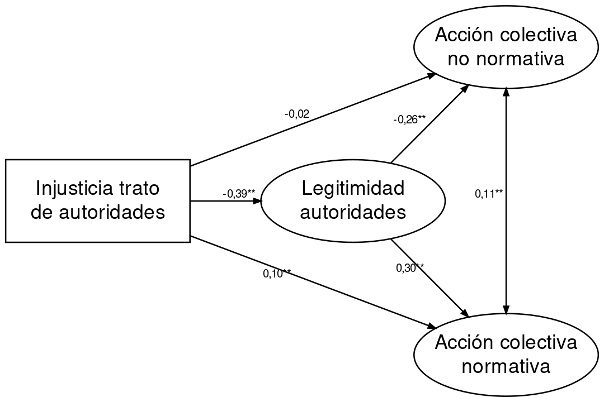

```{r setup, include=FALSE}
knitr::opts_chunk$set(echo = TRUE, message = F, warning = F, results = 'asis')
summarytools::st_options(bootstrap.css     = FALSE,       # Already part of the theme so no need for it
           plain.ascii       = FALSE,       # One of the essential settings
           style             = "rmarkdown", # Idem.
           dfSummary.silent  = TRUE,        # Suppresses messages about temporary files
           footnote          = NA,          # Keeping the results minimalistic
           subtitle.emphasis = FALSE)       # For the vignette theme, this gives better results.
#summarytools::st_css()

library(ggplot2); theme_set(theme_classic() + theme(text = element_text(size = 12)))
library(knitr);  options(knitr.kable.NA = '')
```

```{r packages, echo = F}
# 1. Cargar paquetes
pacman::p_load(tidyverse, kableExtra, DT, readxl)
# 2. Cargar tablas
codebook <- readxl::read_excel(path = "../../input/elsoc/Listado_Variables_ELSOC_Longitudinal_2016_2017_2018_2019.xlsx",sheet = "Variables")
```
----
# Introducción

En el siguiente documento es un borrador para el trabajo con la base de datos longitudinal `ELSOC`. Para ello se trabajará con los siguientes documentos que se enlistan según función:

## Hipótesis 

- Paper Gerber, Moya, Castillo, Orchard and Puga (2020) ["Acting collectively againts injustice"](https://osf.io/ng8tf/)

- Fichas realizadas sobre teorías de la acción colectiva (eg. Klandermans, Cohen, Watts, Olson) para verificar si existen hipótesis generativas y/o temporales. 

## Metodología

- [Manual de usuario de ELSOC](/input/elsoc/Instrucciones Uso Base wide ELSOC 2016-2019.docx)

- [Bases de datos ELSOC](input/elsoc/ELSOC_Wide_2016_2019_Merge_v1.00_R.RData)
- [Libro de códigos ELSOC](/input/elsoc/Listado_Variables_ELSOC_Longitudinal_2016_2017_2018_2019.xlsx)

- Actualizar lecturas sobre panel data
  + Andreß et al (2013) Applied Panel Data Analysis for Economic and Social Surveys
  + Smith and Fuertes (2017) Panel Time-Series 
  + Sigmund and Ferstl (2019) Panel Vector Autoregression in R with the package panelvar
  + Agregar uno temático como el de Fitzenberger et. al (1999) Wer ist noch Mitglied in Gewerkschaften? Eine Panelanalyse für Westdeutschland
  
# Artículos

## Acting collectively againts injustice

### Objetivo

Analizar las percepciones de injusticia en eltrato y la legitimidad de las autoridades con el fin de identificar un mecanismo que aienta las acciones por fuera de las normas del sistema y que tienden a involucrar accion violenta.

### Hipótesis

**General**: Las personas se sienten más dispuestas a movilizarse cuando perciben que una situación es injusta (percepción injusticia), se sienten capaces de generar un cambio (percepción de eficacia) y se identifican con otras personas de un mismo grupo identidad social). Se prueba en  acciones colectivas normativas y acciones colectivas no-normativas

**Específicas**: Se basan en injusticia en el trato que las personas perciben respecto a las autoridades

#### A. Directas

- $H_1$. Una mayor percepción de injusticia en el trato de las autoridades, menor será la percepción de legitimidad de de autoridades
- $H_2a$. Una mayor legitimación de las autoridades, por su parte, se debiera asociar a una menor justificación de la acción colectiva no-normativa

- $H_2b$. (...) A una mayor normativa (two-sides)
- $H_3a$. La percepción de injusticia en el trato tendrá efectos directos positivos en la justificación de la acción colectiva no-normativa.
- $H_3b$. y normativa (one side?)

#### B. Indirectas

- $H_4a$. A mayor percepción de injusticia en el trato, menor legitimación en autoridades y eso aumenta acción colectiva no normativa. (med positivo)

- $H_4b$.  Y una menor en normativa. (med negativo)

### Metodología

- Base PNUD (2015), n = 1.805 casos

- SEM (latentes son legitimidad de autoridades, justificación acción colectiva normativa y no-normativa)

### Mediciones

1. **Justificación de la acción colectiva contenciosa** (normativa)

  + *“Organizar plebiscitos para que la mayoría decida”*

  + *“Organizar asambleas y reuniones para tomar las decisiones entre todos”*

  + Escala de respuestas desde 1 = “es la peor forma de tomar decisiones” hasta 10 = “es la mejor forma de tomar decisiones”.

2.  **Justificación de la acción colectiva transgesora** (no-normativa)

  + *“Que las personas participen en marchas o manifestaciones públicas no autorizadas”*

  + *“Que las personas participen en un bloqueo de calles o carreteras”*

  + *“Que las personas se tomen terrenos privados, fábricas, oficinas”*

  + *“Que los estudiantes se tomen sus escuelas, liceos, universidades”*

  + *“Que las personas hagan huelgas de hambre”*

  + *“Que las personas usen la fuerza física contra la policía”*

  + *“Que las personas pinten o rayen las paredes con sus demandas o consignas”*

  + Escala de respuestas desde 1 = “nunca se justifica” hasta 10 = “siempre se justifica”.
  
3. **Percepciones de injusticia en el trato de autoridades:**

  + *“¿Con qué frecuencia diría usted que las  autoridades políticas tratan a la gente con respeto?”*
  
  + Escala de respuestas desde 1= “nunca” hasta 7 = “siempre”.

4. **Legitimidad autoridades:**

  + “¿Hasta qué punto es su deber respetar las decisiones que toman [autoridad] aunque no esté de acuerdo con ellas?“.

  + Autoridades políticas, Tribunales de Justicia y policía

  + Escala de respuestas desde 1 = “no es en absoluto mi deber” hasta 7 = “es totalmente mi deber”).

5. **Controles**:

  + Identificación con causas
  
  + Percepción de eficacia
  
  + Sociodemográficas.
  
### Resultados




# Datos ELSOC

## Disponibilidad de mediciones por ola

En la **Tabla 1** y **Tabla 2** presentamos la disponibilidad por ola de cada una de las mediciones. En Anexos se puede encontrar el [libro general de códigos](#tab3) y [cuestionario](#ques)  

El color rojo indica que esta no está disponible en esa ola y verde que si está disponible en aquella ola.

**Tabla 1.** Disponibilidad de variables dependientes según año de aplicación de ELSOC
```{r, echo=FALSE}
codebook <- as.data.frame(codebook)

#Muestra1_W01 -->ola 1
#Muestra1_W02 -->ola2
#Muestra1_W03 -->ola3
#Muestra1_W04 -->ola4
  
codebook %>% filter(Tipo == "Dependiente") %>%
  select(c(2,5:7, "2016" ="Muestra1_W01","2017" ="Muestra1_W02","2018" ="Muestra1_W03","2019" ="Muestra1_W04" )) %>%
  mutate_at(vars(4:7),  ~ if_else(!is.na(.), " ", .))  %>% 
    datatable(rownames = FALSE, options = list(autoWidth = TRUE,language = list(url = '//cdn.datatables.net/plug-ins/1.10.11/i18n/Spanish.json'),
  pageLength = 10)) %>%
    formatStyle(c(4:7), backgroundColor = styleEqual(NA, "red")) %>%
  formatStyle(c(4:7), backgroundColor = styleEqual(" ", "green"))
```

**Tabla 2.** Disponibilidad de variables independientes según año de aplicación de ELSOC
```{r, echo=FALSE}
codebook %>% filter(Tipo != "Dependiente") %>%
  select(c(2,5:7, "Ola 1" ="Muestra1_W01","Ola 2" ="Muestra1_W02","Ola 3" ="Muestra1_W03","Ola 4" ="Muestra1_W04" )) %>%
  mutate_at(vars(4:7),  ~ if_else(!is.na(.), " ", .))  %>% 
    datatable(rownames = FALSE,options = list(language = list(url = '//cdn.datatables.net/plug-ins/1.10.11/i18n/Spanish.json'),
  pageLength = 100)) %>%
    formatStyle(c(4:7), backgroundColor = styleEqual(NA, "red")) %>%
  formatStyle(c(4:7), backgroundColor = styleEqual(" ", "green"))
```


# Anexos

## Libro de códigos {#tab3}

**Tabla 3.** Libro de códigos para análisis de datos con ELSOC
```{r, echo=FALSE}
codebook <- as.data.frame(codebook)
codebook <- codebook[,-3]
#codebook %>%  knitr::kable(digits = 2, row.names = F,  booktabs = T)  %>% kableExtra::kable_styling(bootstrap_options = c("striped", "hover", "condensed", "responsive"), full_width = T) %>% collapse_rows(columns = 1:12)

DT::datatable(codebook, options = list(language = list(url = '//cdn.datatables.net/plug-ins/1.10.11/i18n/Spanish.json'),
  pageLength = 5))
```

## Cuestionario {#ques}

1. **Preguntas permanentes** 

- **Acciones normativas**

  + Participación ciudadana: "Durante los últimos 12 meses, con cuánta frecuencia usted ha ..."
  
    a.  Firmado una carta o petición apoyando una causa
    b.  Usado las redes sociales para expresar su opinión en temas públicos
    
- **Acciones no- normativas**

  + Participación ciudadana: "Durante los últimos 12 meses, con cuánta frecuencia usted ha ..."
  
    a.  Asistido a una marcha o manifestación política
    b.   Participado en una huelga
    
  + Justificación Violencia: ¿En qué medida cree usted que se justifican o no se justifican las siguientes situaciones? 
  
    a.  Que un grupo de trabajadores en huelga bloquee la calle con barricadas para exigir el cumplimiento de sus derechos laborales
    b.  Que estudiantes tiren piedras a Carabineros en una marcha por la educación del país

- **Identidad social**

  + Identidad de clase: En la sociedad, comúnmente, existen distintos grupos o clases sociales. Las personas de clase social alta son las que tienen los ingresos más altos, el mayor nivel de educación y los trabajos más valorados. Las personas de clase social baja son las que tienen los ingresos más bajos, el menor nivel de educación y los trabajos menos valorados. Entre estas clases existen otras intermedias. Según su opinión, a cuál de los siguientes grupos o clases sociales pertenece usted (Leer todas las categorías):
  
- **Eficacia**

  + Autoeficacia política: ¿En qué medida se encuentra usted de acuerdo o en desacuerdo con cada una de las siguientes afirmaciones?
  
    a.  Mi voto influye en el resultado de la elección
    b.  Votar permite expresar mis ideas

- **Pertenencia a causa**

  + Movimientos sociales: Pensando en la lista de movimientos sociales que a continuación le mostraré, por favor indique ¿cuál es el que usted más valora?


2. **Preguntas intercaladas**

Las variables que podrían aproximarse a **Legitimidad autoridades**,  **Justicia en el trato** y **Disposición a participar** están para al menos 2 olas y para las mismas (ola1 y ola3)

- **Justicia en trato**

  + Perceción Trato Justo: ¿Con cuánta frecuencia diría que personas como usted son tratadas con respeto...?"
  
    a.   En el trabajo
    b.   Por Carabineros
    c.  Por personas de clase alta

